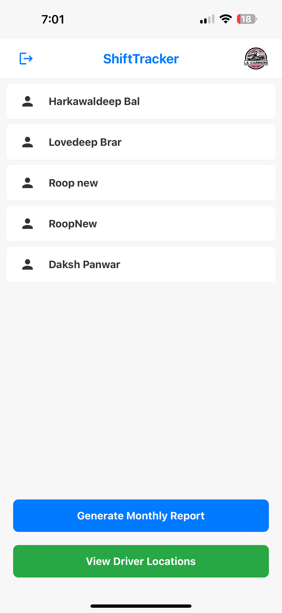
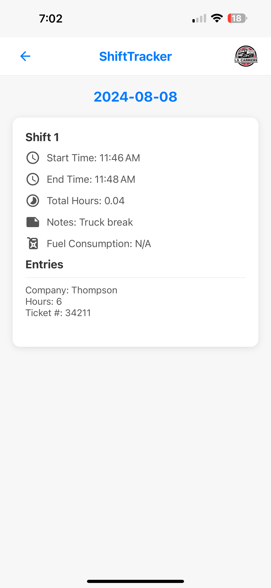

# ShiftTracker

[](https://apps.apple.com/ca/app/ls-shifttracker/id6636515709)

**ShiftTracker** is a comprehensive employee management application designed specifically for LS Carriers, an Edmonton-based trucking company. This mobile app streamlines the process of clocking in and out, tracking work hours, managing driver schedules, and generating detailed reports, ensuring efficient and accurate workforce management.

## Table of Contents

- [Features](#features)
- [Technologies Used](#technologies-used)
- [Screenshots](#screenshots)
- [Installation](#installation)
- [Usage](#usage)
- [Contributing](#contributing)
- [License](#license)
- [Contact](#contact)

## Features

- **User Authentication**
  - Secure login and signup functionalities for employees.
  - Firebase Authentication integration for managing user sessions.

- **Clock In/Clock Out**
  - Simple and intuitive interface for employees to clock in and out.
  - Location verification to ensure employees are within the designated area (Edmonton Yard) when clocking in/out.
  - Optional note addition for each clock in/out action.

- **Shift Tracking**
  - Real-time tracking of shift durations.
  - Display of total hours worked since clocking in.

- **Driver Management**
  - Comprehensive list of all drivers with detailed profiles.
  - Calendar view to track and manage driver schedules.
  - Date-wise shift summaries including start time, end time, total hours, fuel consumption, and ticket entries.

- **Reporting**
  - Generate monthly reports detailing hours worked and fuel consumption for each driver.
  - Export reports in Excel format for easy sharing and record-keeping.

- **Location Tracking**
  - Real-time tracking of driver locations on a map.
  - Integration with Firebase Firestore to store and update live locations.

- **Image Handling**
  - Ability to attach images (e.g., tickets, fuel receipts) during clock out.
  - Image resizing and compression for efficient storage and upload.
  - View attached images in high resolution within the app.

- **User Interface**
  - Clean and user-friendly design tailored for ease of use.
  - Responsive layouts compatible with various device sizes.

## Technologies Used

- **React Native**: Framework for building native apps using React.
- **Expo**: Platform for making universal React applications.
- **Firebase**:
  - **Authentication**: Managing user sign-in and sign-up processes.
  - **Firestore**: Real-time NoSQL cloud database for storing app data.
  - **Storage**: Storing and retrieving user-uploaded images.
- **React Navigation**: Handling in-app navigation and routing.
- **Expo Location**: Accessing and handling device location data.
- **Expo Image Picker & Image Manipulator**: Handling image selection, resizing, and compression.
- **Moment-Timezone**: Managing and manipulating date and time across different time zones.
- **Expo Sharing**: Facilitating sharing of generated reports.
- **XLSX**: Generating Excel reports from JSON data.


## Screenshots

<p align="center">     </p> <p align="center">     </p>

## Installation

To get a local copy up and running, follow these steps:

### Prerequisites

- **Node.js**: Ensure you have Node.js installed. You can download it [here](https://nodejs.org/).
- **Expo CLI**: Install Expo CLI globally using npm:

  ```bash
  npm install -g expo-cli
  ```

- **Firebase Account**: Set up a Firebase project [here](https://firebase.google.com/).

### Steps

1. **Clone the Repository**

   ```bash
   git clone https://github.com/yourusername/shifttracker.git
   ```

2. **Navigate to the Project Directory**

   ```bash
   cd shifttracker
   ```

3. **Install Dependencies**

   ```bash
   npm install
   ```

4. **Configure Firebase**

   - Create a `firebase.js` file in the root directory with your Firebase configuration:

     ```javascript
     // firebase.js
     import { initializeApp } from 'firebase/app';
     import { getFirestore } from 'firebase/firestore';
     import { getAuth } from 'firebase/auth';
     import { getStorage } from 'firebase/storage';

     const firebaseConfig = {
       apiKey: "YOUR_API_KEY",
       authDomain: "YOUR_AUTH_DOMAIN",
       projectId: "YOUR_PROJECT_ID",
       storageBucket: "YOUR_STORAGE_BUCKET",
       messagingSenderId: "YOUR_MESSAGING_SENDER_ID",
       appId: "YOUR_APP_ID",
     };

     const app = initializeApp(firebaseConfig);
     const firestore = getFirestore(app);
     const auth = getAuth(app);
     const storage = getStorage(app);

     export { firestore, auth, storage };
     ```

   - Replace the placeholder values with your actual Firebase project credentials.

5. **Run the App**

   ```bash
   expo start
   ```

   - This will start the development server. You can run the app on an emulator or a physical device using the Expo Go app.

## Usage

1. **Login/Signup**
   - Open the app and log in using your credentials. New users can sign up if registration is enabled.

2. **Clock In**
   - Navigate to the home screen and tap on "Clock In".
   - Optionally add a note and confirm your clock-in. Ensure you are within the Edmonton Yard for location verification.

3. **Clock Out**
   - When your shift is over, tap on "Clock Out".
   - Add any necessary notes, fuel usage details, and ticket entries. Attach images if required.

4. **View Shifts**
   - Access the driver list to view all employees.
   - Tap on a driver to view their calendar and shift summaries for specific dates.

5. **Generate Reports**
   - From the driver list screen, generate monthly reports detailing hours worked and fuel consumption.
   - Export reports in Excel format for sharing and record-keeping.

6. **Location Tracking**
   - View live locations of drivers on the map to monitor their current status.


## License

Distributed under a custom License. See `LICENSE` for more information.

## Contact

Roopdilawar Singh - [@github](https://github.com/Roopdilawar) - roopdilawar@gmail.com

Project Link: [https://github.com/Roopdilawar/ShiftTracker](https://github.com/Roopdilawar/ShiftTracker)
